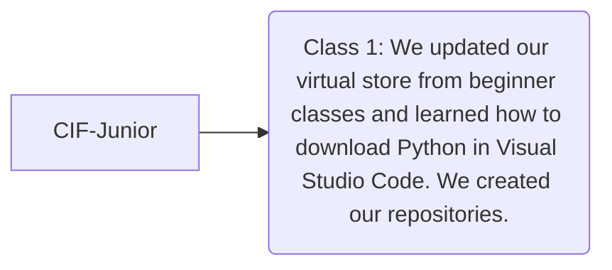

# CIF-Junior
Public repository for CIF (Coding is Fun) junior students. 

## Introduction
CIF is an open-source organization for students (grade 5 - grade 8) who are interested in Python. It provides knowledge for basic syntax, casting, input, loops, lists. If you are interested, please enroll your child by clicking this link [here](https://www.itisfun.org/). 

## Classes
We have 20 classes in total (3 covered).

